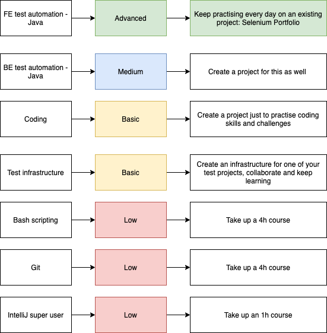

<!-- PROJECT LOGO -->
 

<h3 align="center">Serenity BDD + Test Infrastructure Portfolio WORK IN PROGRESS</h3>
  

  This project has been created by Aleksandra L. for and practicing test automation. 
    <a href="https://github.com/othneildrew/Best-README-Template"><strong>Explore the docs »</strong></a>
     
     
    <a href="https://github.com/othneildrew/Best-README-Template">View Demo</a>
    ·
    <a href="https://github.com/othneildrew/Best-README-Template/issues">Report Bug</a>
    ·
    <a href="https://github.com/othneildrew/Best-README-Template/issues">Request Feature</a>
  

